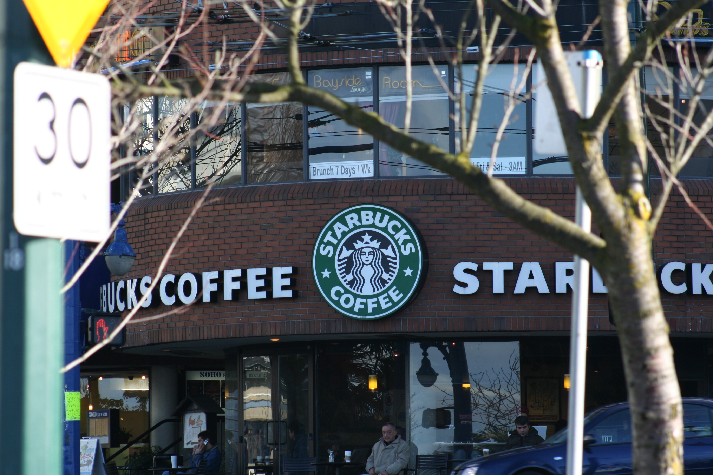

# Starbucks Capstone Challenge

This project is part of Udacity’s Data Science Nanodegree which contains simulated data that mimics customer behavior on the Starbucks rewards mobile app. This project aims to build a machine learning model to determine which demographic groups are more likely to complete an offer and predict how much someone will spend. Not all users receive the same offer, and that is the challenge to solve with this data set.

<div align="center">

</div>
<div align="center">
<u> **How to increase turnover?** </u>
</div>

### Table of Contents

1. [Installation](#installation)
2. [Project Motivation](#motivation)
3. [File Descriptions](#files)
4. [Deploy](#results)
5. [Licensing, Authors, and Acknowledgements](#licensing)

## Installation <a name="installation"></a>

[Installing scikit-learn](https://scikit-learn.org/stable/install.html)
```
pip install -U scikit-learn
```

[Installing TensorFlow](https://www.tensorflow.org/install)
```
# Requires the latest pip
pip install --upgrade pip

# Current stable release for CPU and GPU
pip install tensorflow
```
or 
```
docker pull tensorflow/tensorflow:latest-py3  # Download latest stable image
docker run -it -p 8888:8888 tensorflow/tensorflow:latest-py3-jupyter  # Start Jupyter server 
```

## Project Motivation<a name="motivation"></a>
The basic task was to build a model to identify whether or not someone will respond to an offer? I think The user’s behavior depends on the user’s characteristics and Starbucks’s reward methods. so I will try to understand hidden relationships in the transaction, demographic, and offer data. I will try to find Which factors are important for customers?


## File Descriptions <a name="files"></a>


```
- Starbucks_Capstone_notebook.ipynb  # data to process 
- Starbucks_Capstone_notebook .html  # report 
- README.md
- data
|- portfolio.json # containing offer ids and meta data about each offer (duration, type, etc.)
|- profile.json # demographic data for each customer
|- process_data.py
|- transcript.json # records for transactions, offers received, offers viewed, and offers completed
```

## Deploy <a name="results"></a>

https://medium.com/@tomgtbst/starbucks-capstone-challenge-fd6e9e27119e


## Licensing, Authors, and Acknowledgements <a name="licensing"></a>

### Built With

* [Pandas](https://pandas.pydata.org/) - pandas is a fast, powerful, flexible and easy to use open source data analysis and 
* [scikit-learn](https://scikit-learn.org) - scikit-learn is a Python module for machine learning built on top of SciPy.
* [TensorFlow](https://www.tensorflow.org/) - TensorFlow is an end-to-end open source platform for machine learning.

### Versioning

* We use [SemVer](http://semver.org/) for versioning. For the versions available, see the [tags on this repository](https://github.com/your/project/tags).

### Authors

* **Tom Ge** - *Fullstack egineer* - [github profile](https://github.com/tomgtqq)

### License

* This project is licensed under the MIT License
